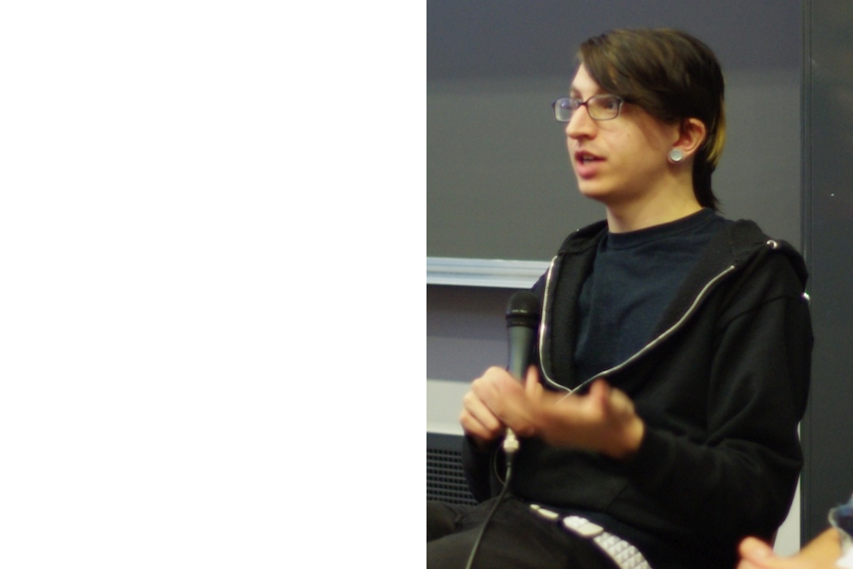

!SLIDE center

[_The best motivational poster ever_](http://mysterycoder.blogspot.be/2008/05/best-motivational-poster-in-world.html)

!SLIDE center

[_wroc\_love.rb day 2 031_ by Rrrodrigo](https://secure.flickr.com/photos/rrrodrigo/6848064576/)

!SLIDE center

[_wroc\_love.rb day 2 031_ by Rrrodrigo](https://secure.flickr.com/photos/rrrodrigo/6848064576/)

!SLIDE center

[_wroc\_love.rb day 2 031_ by Rrrodrigo](https://secure.flickr.com/photos/rrrodrigo/6848064576/)

!SLIDE commandline incremental transition=scrollLeft
    $ signore prego
    Every time I read old computer science articles, I find
    that everyone figured everything out before I was even born.
                                                 [Steve Klabnik]

!SLIDE center

!SLIDE center

!SLIDE bullets incremental
# transparent persistence
* object databases
* [MagLev](http://maglev.gemstone.com)
* [Would you like to forget about the database?](http://confreaks.com/videos/1070-cascadiaruby2012-would-you-like-to-forget-about-the-database)
* fake transparent persistence
* [Candy](https://github.com/SFEley/candy)

!SLIDE
    @@@ Ruby
    require 'bson'
    BSON::ObjectID = BSON::ObjectId

       

!SLIDE
    @@@ Ruby
    require 'bson'
    BSON::ObjectID = BSON::ObjectId
    require 'candy'

       

!SLIDE
    @@@ Ruby
    require 'bson'
    BSON::ObjectID = BSON::ObjectId
    require 'candy'
    class Sig
      include Candy::Piece
    end

       

!SLIDE
    @@@ Ruby
    require 'bson'
    BSON::ObjectID = BSON::ObjectId
    require 'candy'
    class Sig
      include Candy::Piece
    end

    fogus = Sig.new        # localhost:27017, ‘chastell’ db, ‘Sig’ collection

       

!SLIDE
    @@@ Ruby
    require 'bson'
    BSON::ObjectID = BSON::ObjectId
    require 'candy'
    class Sig
      include Candy::Piece
    end

    fogus = Sig.new        # localhost:27017, ‘chastell’ db, ‘Sig’ collection
    fogus.author = 'fogus' # method_missing resaves

       

!SLIDE
    @@@ Ruby
    require 'bson'
    BSON::ObjectID = BSON::ObjectId
    require 'candy'
    class Sig
      include Candy::Piece
    end

    fogus = Sig.new        # localhost:27017, ‘chastell’ db, ‘Sig’ collection
    fogus.author = 'fogus' # method_missing resaves
    fogus.tags   = ['Ruby', 'Java']

       

!SLIDE
    @@@ Ruby
    require 'bson'
    BSON::ObjectID = BSON::ObjectId
    require 'candy'
    class Sig
      include Candy::Piece
    end

    fogus = Sig.new        # localhost:27017, ‘chastell’ db, ‘Sig’ collection
    fogus.author = 'fogus' # method_missing resaves
    fogus.tags   = ['Ruby', 'Java']
    fogus.text   = 'How many lines of Java would it take to do this? ' +
      'obj.class.superclass.public_instance_methods(false).sort'

       

!SLIDE
    @@@ Ruby
    require 'bson'
    BSON::ObjectID = BSON::ObjectId
    require 'candy'
    class Sig
      include Candy::Piece
    end

    fogus = Sig.new        # localhost:27017, ‘chastell’ db, ‘Sig’ collection
    fogus.author = 'fogus' # method_missing resaves
    fogus.tags   = ['Ruby', 'Java']
    fogus.text   = 'How many lines of Java would it take to do this? ' +
      'obj.class.superclass.public_instance_methods(false).sort'

    michael = Sig.new author: 'Michael Feathers', tags: ['Ruby', 'coding'],
      text: 'At the dentist’s thinking about whether hints of method size can ' +
      'be seen in intra-class dependency diagrams. Oh no, here comes the drill.'

       

!SLIDE
    @@@ Ruby
    require 'bson'
    BSON::ObjectID = BSON::ObjectId
    require 'candy'
    class Sig
      include Candy::Piece
    end

    fogus = Sig.new        # localhost:27017, ‘chastell’ db, ‘Sig’ collection
    fogus.author = 'fogus' # method_missing resaves
    fogus.tags   = ['Ruby', 'Java']
    fogus.text   = 'How many lines of Java would it take to do this? ' +
      'obj.class.superclass.public_instance_methods(false).sort'

    michael = Sig.new author: 'Michael Feathers', tags: ['Ruby', 'coding'],
      text: 'At the dentist’s thinking about whether hints of method size can ' +
      'be seen in intra-class dependency diagrams. Oh no, here comes the drill.'

    zach = Sig.new author: 'Zach Holman', tags: ['coding', 'work'],
      text: 'I think programming riddles, games, and brain teasers are a great ' +
      'way to hire. First one to say ‘fuck this!’ and walk out gets the job.'

!SLIDE
    @@@ Ruby
    class Sigs
      include Candy::Collection

    end

     

!SLIDE
    @@@ Ruby
    class Sigs
      include Candy::Collection
      collects Sig
    end

     

!SLIDE
    @@@ Ruby
    class Sigs
      include Candy::Collection
      collects Sig
    end

    sig = Sigs.tags('coding').to_a.sample.refresh

     

!SLIDE
    @@@ Ruby
    class Sigs
      include Candy::Collection
      collects Sig
    end

    sig = Sigs.tags('coding').to_a.sample.refresh
    puts sig.text
    puts '— ' + sig.author

     

!SLIDE
    @@@ Ruby
    class Sigs
      include Candy::Collection
      collects Sig
    end

    sig = Sigs.tags('coding').to_a.sample.refresh
    puts sig.text
    puts '— ' + sig.author

    # I think programming riddles, games, and brain teasers are a great
    # way to hire. First one to say ‘fuck this!’ and walk out gets the job.
    # — Zach Holman
