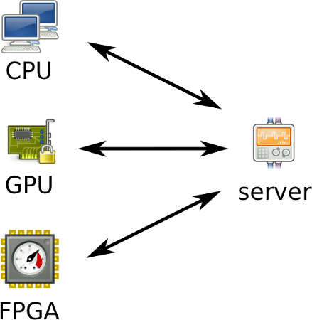

!SLIDE transition=scrollLeft
# sieć klientów z akceleracją sprzętową

!SLIDE bullets incremental transition=scrollLeft
# możliwości komunikacyjne
* CPU: w zasadzie dowolne (Ethernet, IP, UDP, TCP, HTTP)
* GPU: w praktyce dowolne (Ethernet, IP, UDP, TCP, HTTP)
* FPGA: dzięki lwIP Ethernet, IP, UDP, TCP
