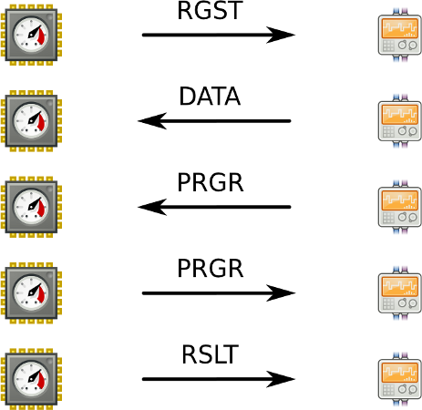

!SLIDE bullets incremental transition=scrollLeft
# protokół
* wykorzystujący TCP
* binarny, z opcjonalnymi komunikatami
* nagłówek: 3 × 128 bitów
* zasoby identyfikowane UUID-ami

!SLIDE transition=scrollLeft
# wiadomość protokołu

!SLIDE bullets incremental transition=scrollLeft
# komunikacja
* rejestracja
* dane do obliczeń
* wynik obliczeń
* komunikaty opcjonalne

!SLIDE transition=scrollLeft
# przykład komunikacji

!SLIDE transition=scrollLeft
# przykład komunikacji
    -> 52475354 00000001 00000000 00000000   // RGST: zarejestruj
       b8658b84 089111e1 ba560024 7e152e48   // to mój UUID
       c2350608 089111e1 bac00024 7e152e48   // umiem faktoryzować

    <- 44415441 0000cafe 00000000 00000000   // DATA: oblicz
       b8658b84 089111e1 ba560024 7e152e48   // to Twój UUID
       6f97cfce 089211e1 8bac0024 7e152e48   // to UUID zadania
       d2                                    // sfaktoryzuj 210

    <- 50524752 0000caff 00000000 00000000   // PRGR: podaj postęp
       b8658b84 089111e1 ba560024 7e152e48   // to Twój UUID
       6f97cfce 089211e1 8bac0024 7e152e48   // to UUID zadania

    -> 50524752 00000002 00000003 00000004   // PRGR: jestem w 3/4
       b8658b84 089111e1 ba560024 7e152e48   // to mój UUID
       6f97cfce 089211e1 8bac0024 7e152e48   // to UUID zadania

    -> 44415441 00000003 00000000 00000000   // RSLT: podaję wynik
       b8658b84 089111e1 ba560024 7e152e48   // to mój UUID
       6f97cfce 089211e1 8bac0024 7e152e48   // to UUID zadania
       02030507                              // wynik: 2, 3, 5, 7
