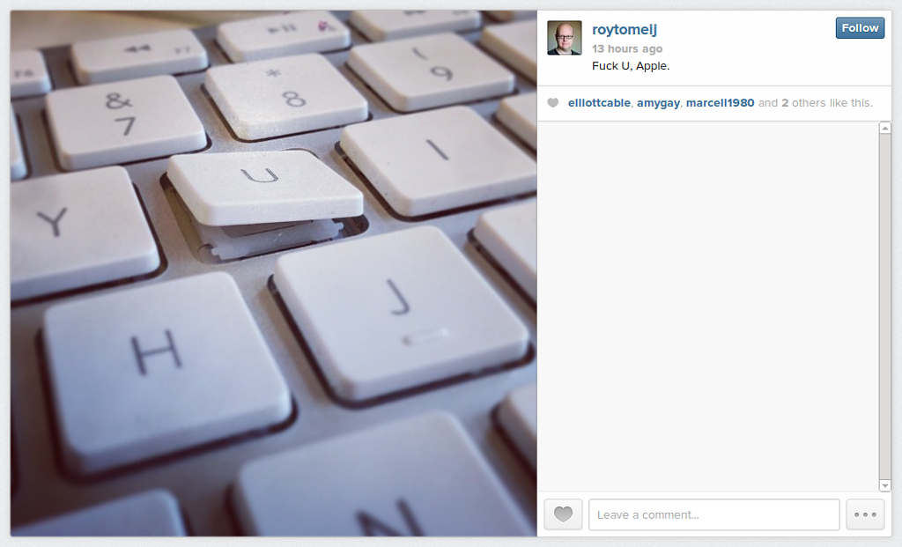

!SLIDE center full-screen transition=scrollLeft

### [Fuck U, Apple.](http://instagram.com/p/c5_V8pMHiM)

!SLIDE center

## If you’re referring to Apple’s desktop keyboards, the solution is much the same as with Apple mice: you unplug the Apple-provided piece of shit, throw it away, and plug in something that doesn’t suck.  Actually, the keyboard, being small, thin and light, is handy for dropping onto the crash cart in a datacentre. Partly because it’s easy to hold it in one’s teeth while half way up a ladder and swearing at a Linux box, and partly because it’s a piece of shit and therefore won’t go walkabouts.  — Peter Corlett, [hates-software](http://hates-software.com)
