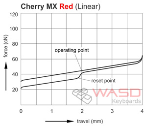
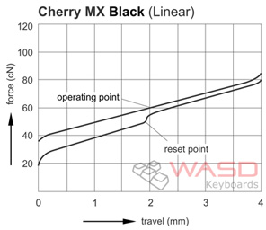
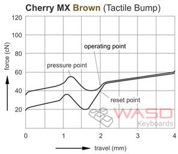
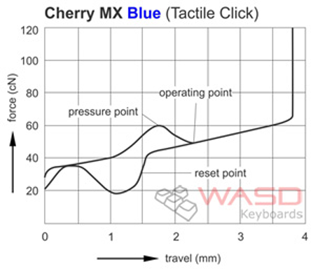

!SLIDE center

### [overclock.net: Mechanical Keyboard Guide](http://www.overclock.net/t/491752/mechanical-keyboard-guide)
### [WASD Keyboards: Mechanical Keyboard Guide](http://www.wasdkeyboards.com/mechanical-keyboard-guide)

!SLIDE center

### [overclock.net: Mechanical Keyboard Guide](http://www.overclock.net/t/491752/mechanical-keyboard-guide)
### [WASD Keyboards: Mechanical Keyboard Guide](http://www.wasdkeyboards.com/mechanical-keyboard-guide)

!SLIDE center

### [overclock.net: Mechanical Keyboard Guide](http://www.overclock.net/t/491752/mechanical-keyboard-guide)
### [WASD Keyboards: Mechanical Keyboard Guide](http://www.wasdkeyboards.com/mechanical-keyboard-guide)

!SLIDE center

### [overclock.net: Mechanical Keyboard Guide](http://www.overclock.net/t/491752/mechanical-keyboard-guide)
### [WASD Keyboards: Mechanical Keyboard Guide](http://www.wasdkeyboards.com/mechanical-keyboard-guide)

!SLIDE center transition=scrollLeft

## ‘When you type it sounds like you’re angry at the alphabet.’  — David Brady
