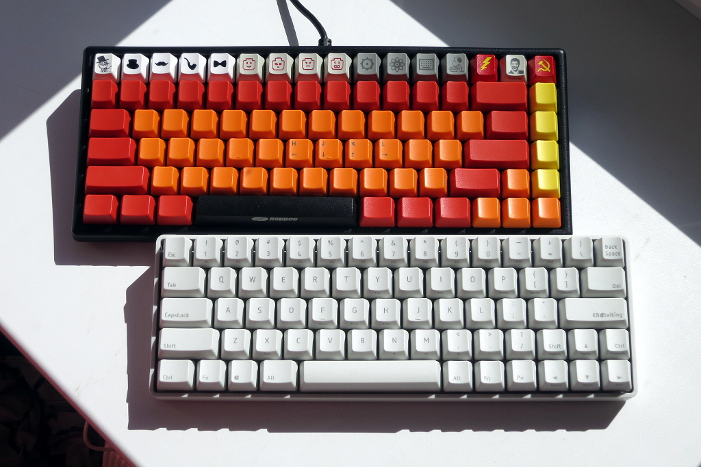

!SLIDE center transition=scrollLeft

## CoffeeScript is what happens when you look at the top row of your keyboard and think, ‘Hey! JavaScript isn’t using some of those!’  — Paul Battley

!SLIDE center full-screen transition=scrollLeft

!SLIDE center full-screen

!SLIDE center full-screen

!SLIDE center full-screen

!SLIDE center full-screen

