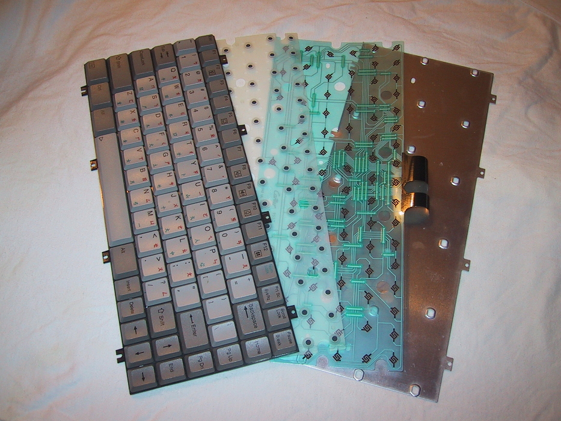

!SLIDE center full-screen transition=scrollLeft

### [Model M keyboard](http://en.wikipedia.org/wiki/Model_M_keyboard)

!SLIDE center full-screen

### [Model M keyboard](http://en.wikipedia.org/wiki/Model_M_keyboard)

!SLIDE center full-screen

### [Unicomp EnduraPro](http://pckeyboard.com/page/EnduraPro/UNI0PGA)

!SLIDE center full-screen

### [overclock.net: Mechanical Keyboard Guide](http://www.overclock.net/t/491752/mechanical-keyboard-guide)

!SLIDE center full-screen

### [10 rzeczy, których nie wiedziałeś o własnej klawiaturze](http://m.technologie.gazeta.pl/internet/1,113033,14361830.html)

!SLIDE center full-screen

### [Keyboard technology](http://en.wikipedia.org/wiki/Keyboard_technology)

!SLIDE center full-screen transition=scrollLeft

### [Keyboard technology](http://en.wikipedia.org/wiki/Keyboard_technology)
