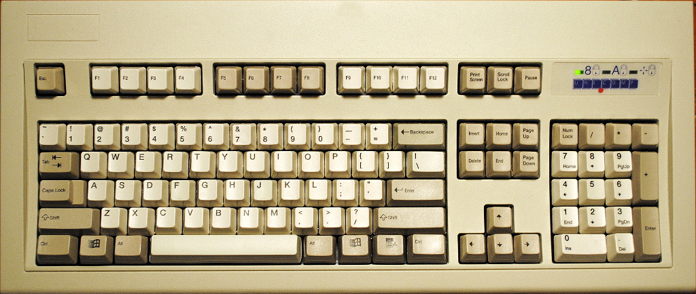
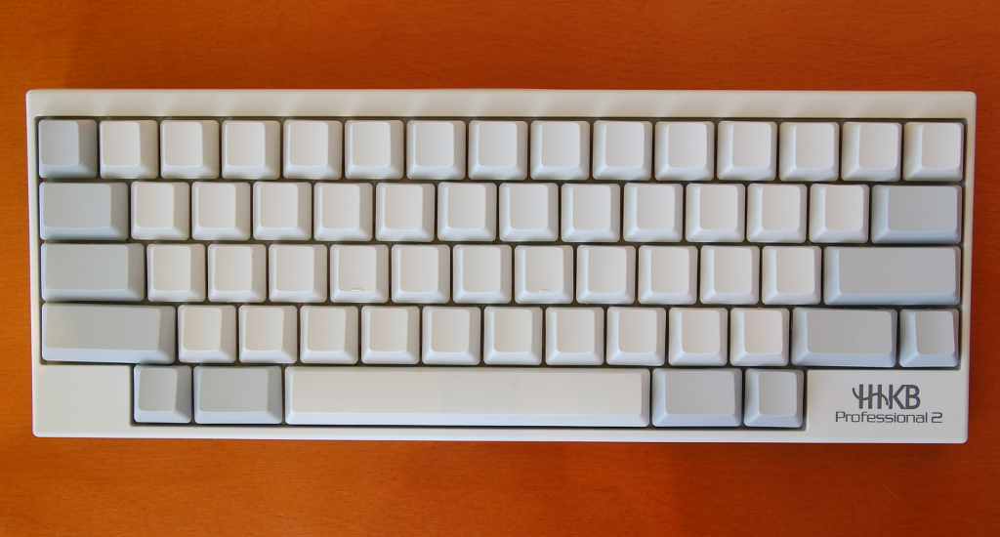

!SLIDE bullets incremental transition=scrollLeft

# widths

* full: 100+ keys
* mid: 80+ keys
* small: 60+ keys

!SLIDE center full-screen

### [Model M keyboard](http://en.wikipedia.org/wiki/Model_M_keyboard)

!SLIDE center full-screen

### [@lukaszkorecki](https://twitter.com/lukaszkorecki)

!SLIDE center full-screen

### [Happy Hacking Keyboard](https://en.wikipedia.org/wiki/Happy_Hacking_Keyboard)

!SLIDE center full-screen

### [Richard Stallman has been Happy Hacking since 1997](http://imgur.com/r/MechanicalKeyboards/zT5pgsd)
