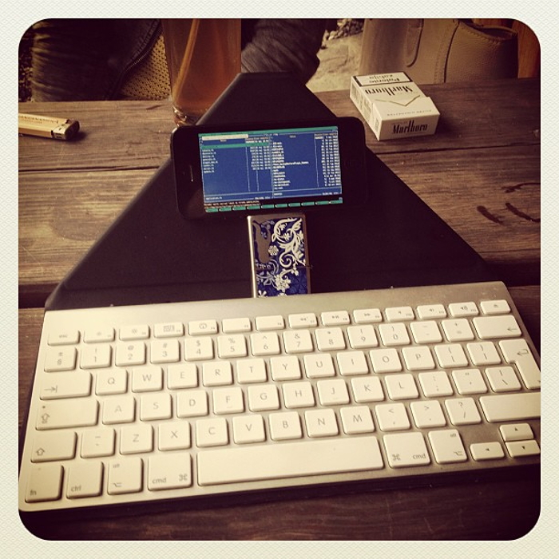
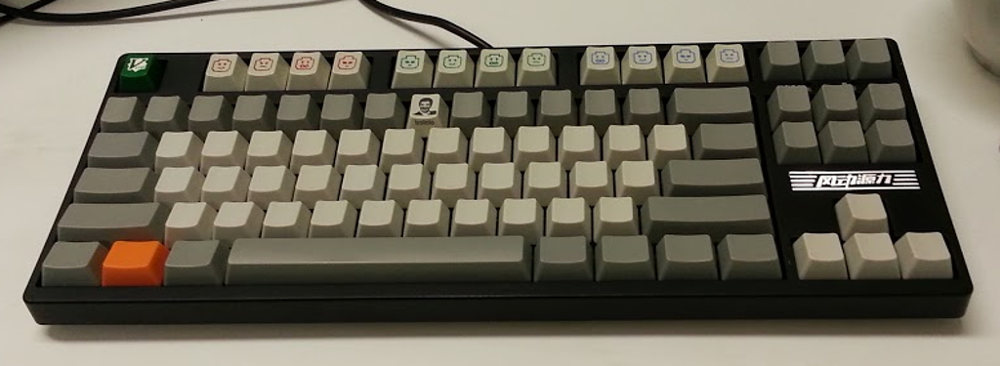

!SLIDE center transition=scrollLeft

## If it doesn’t have a keyboard, I feel that my thoughts are being forced out through a straw.  — Joey Hess, _[The Setup](http://joey.hess.usesthis.com)_

!SLIDE full-screen

### [Introducing, The World’s Simplest Keyboard](https://plus.google.com/photos/115777169768345614675/albums/5664280056634184369/5664280058388494002)

!SLIDE center full-screen

### (please let me know how to attribute it)

!SLIDE center transition=scrollLeft

## The ThinkPad 701c was the top-selling notebook PC of 1995, and the [Butterfly keyboard] design was so innovative that it won 27 awards.        — Carol Pinchefsky, _[7 Awesome Bits of Tech That Just Freakin’ Disappeared](http://h30565.www3.hp.com/t5/Feature-Articles/7-Awesome-Bits-of-Tech-That-Just-Freakin-Disappeared/ba-p/954)_

!SLIDE center

## The ThinkPad 701c was the top-selling notebook PC of 1995, and the [Butterfly keyboard] design was so innovative that it won 27 awards.  Watching the keyboard fold and unfold itself again and again created a sense of childlike glee that most adults find hard to replicate without drugs.  — Carol Pinchefsky, _[7 Awesome Bits of Tech That Just Freakin’ Disappeared](http://h30565.www3.hp.com/t5/Feature-Articles/7-Awesome-Bits-of-Tech-That-Just-Freakin-Disappeared/ba-p/954)_

!SLIDE center

<iframe width='840' height='630' src='//www.youtube.com/embed/478hsrVjVQk' frameborder='0' allowfullscreen></iframe>

!SLIDE center full-screen transition=scrollLeft

### [@lukaszkorecki](https://twitter.com/lukaszkorecki)

!SLIDE center full-screen transition=scrollLeft

### [@lukaszkorecki](https://twitter.com/lukaszkorecki)
