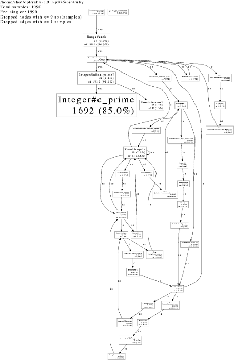

!SLIDE

# Frankenstein programming

!SLIDE bullets incremental

# what about *embedding* foreign language?

* (after all, you can do Assembler in C…)

* Yes We Can:

* RubyInline
* JavaInline
* Hubris

!SLIDE

    @@@ Ruby

    require 'inline'
    class Integer
      def inline_prime?
        c_prime.nonzero?
      end
      inline do |builder|
        builder.c '
          long c_prime() {
            long number = NUM2LONG(self);
            long i;
            for (i = 2; i <= floor(sqrt(number)); i++) {
              if (number % i == 0) return 0;
            }
            return 1;
          }
        '
      end
    end

!SLIDE commandline incremental

    $ time ruby euler.rb 200_000 simple_prime?
    sum(primes < 200000) = 1709600813

    real    0m3.610s
    user    0m3.532s
    sys     0m0.080s

!SLIDE commandline incremental

    $ time ruby euler.rb 200_000 inline_prime?
    1709600813

    real    0m0.787s
    user    0m0.708s
    sys	    0m0.084s

!SLIDE commandline incremental

    $ time ruby euler.rb 2_000_000 inline_prime?
    sum(primes < 2000000) = 142913828922

    real    0m7.906s
    user    0m7.816s
    sys     0m0.080s
    $ time ruby -r perftools euler.rb 2_000_000 inline_prime?
    sum(primes < 2000000) = 142913828922
    PROFILE: interrupts/evictions/bytes = 1990/0/4616

    real    0m8.012s
    user    0m7.924s
    sys     0m0.076s
    $ pprof.rb --pdf euler > euler.pdf
    Dropping nodes with <= 9 samples; edges with <= 1 abs(samples)

!SLIDE

!SLIDE

    @@@ Ruby

    require 'benchmark'
    require 'integer'
    require 'prime'

    Benchmark.bmbm do |bench|
      bench.report 'simple:' do
        (2..100_000).each { |i| i.simple_prime? }
      end
      bench.report 'stdlib:' do
        (2..100_000).each { |i| i.prime? }
      end
      bench.report 'inline:' do
        (2..100_000).each { |i| i.inline_prime? }
      end
    end

!SLIDE commandline incremental

    $ ruby benchmark-inline.rb 
    Rehearsal -------------------------------------------
    simple:   1.270000   0.000000   1.270000 (  1.269095)
    stdlib:   2.580000   0.000000   2.580000 (  2.586706)
    inline:   0.150000   0.000000   0.150000 (  0.147028)
    ---------------------------------- total: 4.000000sec

                  user     system      total        real
    simple:   1.260000   0.010000   1.270000 (  1.262564)
    stdlib:   2.600000   0.010000   2.610000 (  2.614712)
    inline:   0.150000   0.000000   0.150000 (  0.148635)

!SLIDE

# the right solution?

!SLIDE

    @@@ Ruby

    require 'prime'

    puts Prime.take_while { |p| p < 2_000_000 }.inject :+

!SLIDE commandline incremental

    $ time ruby take_while.rb 
    142913828922

    real    0m3.734s
    user    0m3.704s
    sys     0m0.028s
