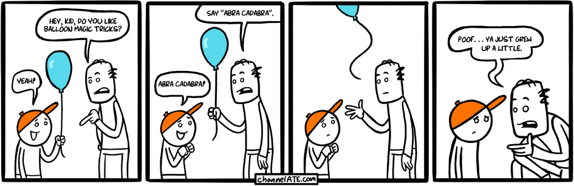

!SLIDE bullets incremental

# recap

* entity relationship management

* tracking crucial information

* customisations

* ownership!

!SLIDE

!SLIDE

!SLIDE

# [civicrm.org](http://civicrm.org/)

!SLIDE bullets incremental

# closing things

* [demo site](http://drupal.demo.civicrm.org/)

* [translation](http://www.transifex.net/projects/p/civicrm/c/civicrm-32/)

* user groups and trainings (see [civicrm.org/blog](http://civicrm.org/blog))

* [talks.chastell.net / lpw-2010](http://talks.chastell.net/lpw-2010)
