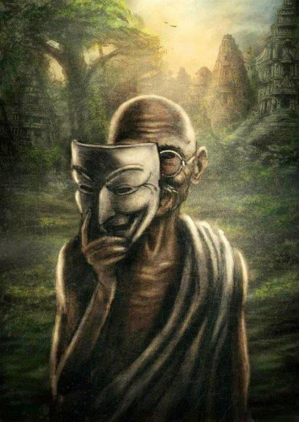
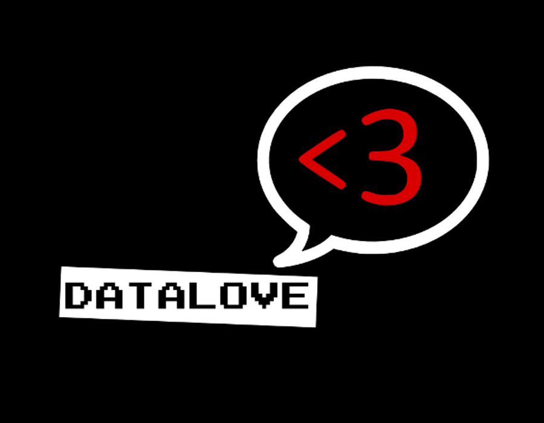
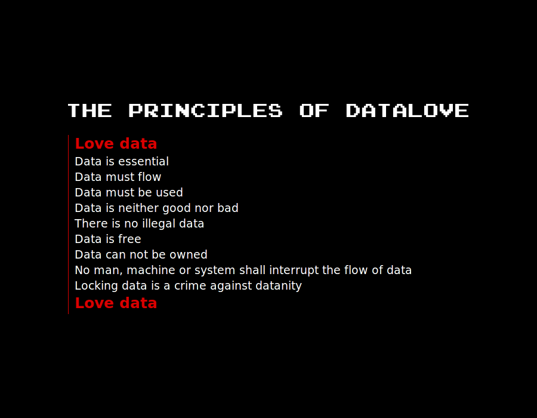
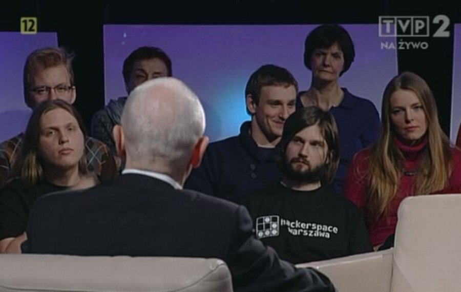

!SLIDE bullets incremental transition=scrollLeft
# haktywizm
* [Anonymous](http://anonnews.org) tango down
* [Telecomix](http://telecomix.org) infrastruktura
* [La Quadrature du Net](http://www.laquadrature.net) prawo i wolności w Internecie

!SLIDE center transition=scrollRight

[#Gandhi #GuyFawkes #Anonymous #Liberty](http://sharaquss.soup.io/post/227512387/Gandhi-GuyFawkes-Anonymous-Liberty)

!SLIDE center

[Wojtuś grzeczny…](http://czerski.tumblr.com/post/16857930932)

!SLIDE bullets incremental transition=scrollLeft
# Anonymous
* blokowanie, DDoS, protesty
* [Zainteresowanie ludzi a „atak”](http://prawo.vagla.pl/node/9669)
* medialny temat nr 1
* włamania i zmiana treści stron
* …ale też współpraca

!SLIDE center transition=scrollLeft

!SLIDE bullets incremental
# Telecomix
* infrastruktura
* Arabska Wiosna
* kopimi
* [Streisand.me](http://streisand.me)
* [datalove.me](http://datalove.me)

!SLIDE center

[datalove.me](http://datalove.me)

!SLIDE center

[datalove.me](http://datalove.me)

!SLIDE bullets incremental
# narzędzia
* Internet Relay Chat
* EtherPad
* mesh networks

!SLIDE bullets incremental transition=scrollLeft
# haktywizm w Polsce
* Improwizowany Kongres Wolnego Internetu
* warszawski hackerspace w _Tomasz Lis na żywo_

!SLIDE center transition=scrollRight

[Hackerspace is not amused](http://hackerspace.pl/blog/2012/02/02/hackerspace-is-not-amused/)

!SLIDE bullets transition=scrollLeft
## haktywizm w Polsce
* [Helsińska Fundacja Praw Człowieka](http://www.hfhr.pl)
* [Fundacja Nowoczesna Polska](http://nowoczesnapolska.org.pl)
* [Fundacja Panoptykon](http://panoptykon.org)
* [Fundacja Wolnego i Otwartego Oprogramowania](http://www.fwioo.pl)
* [Internet Society Poland](http://www.isoc.org.pl)
* [Polska Grupa Użytkowników Linuksa](http://www.linux.org.pl)
