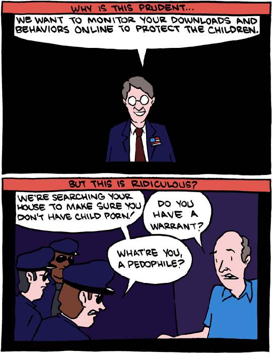

!SLIDE bullets incremental transition=scrollLeft
# problematyka systemowa
* [Co ACTA może zmienić na lotnisku?](http://www.isoc.org.pl/201201/laptopadacta)
* [MSWiA zamówiło narzędzia do „złamania” Tora i podsłuchiwania internautów](http://webhosting.pl/MSWIA.zamowilo.narzedzia.do.zlamania.Tora.i.podsluchiwania.internautow.Czy.zlamalo.przy.tym.prawo)
* [Planned Post-ACTA Repression In European Union: The Documents](http://falkvinge.net/2012/02/08/planned-post-acta-repression-in-european-union-the-documents/)
* [Richard O’Dwyer](http://en.wikipedia.org/wiki/Richard_O%27Dwyer)

!SLIDE center transition=scrollRight

[SMBC](http://www.smbc-comics.com/?db=comics&id=2508)

!SLIDE center

[SMBC](http://www.smbc-comics.com/?db=comics&id=2508)

!SLIDE center

[SMBC](http://www.smbc-comics.com/?db=comics&id=2508)

!SLIDE center

[SMBC](http://www.smbc-comics.com/?db=comics&id=2508)

!SLIDE transition=scrollLeft
# problematyka prawnoautorska
* [Honey Badger, czyli ćwiczenia z prawa autorskiego w internecie](http://polygamia.pl/blogi/hildebrand/2012/01/honey_badger_czyli_cwiczenia_z_prawa_autorskiego_w_internecie)
* 
Czasami gdy bardzo się nudzę, ściągam z sieci jakąś płytę Staszewskiego tylko po to, aby ją skasować. A następnie ściągam jeszcze raz. I jeszcze. Wszytko w nadziei, że uda mi się wygenerować na tyle duże koszty, aby Kazik rzucił tworzenie muzyki w cholerę i zajął się czymś innym. Niestety, na razie bezskutecznie.   — Konrad Hildebrand

!SLIDE bullets
# problematyka prawnoautorska
* [Why I’m a Pirate!](http://ploum.net/post/im-a-pirate)
* [Yarrr.](http://samuraiknitter.blogspot.com.au/2012/02/yarrr.html)
* [My thoughts on S.O.P.A.](http://paulocoelhoblog.com/2012/01/20/welcome-to-pirate-my-books/)
* [Francis Ford Coppola: On Risk, Money, Craft & Collaboration](http://the99percent.com/articles/6973/Francis-Ford-Coppola-On-Risk-Money-Craft-Collaboration)

!SLIDE center transition=scrollRight

[F**k you SOPA](http://9gag.com/gag/1936762)

!SLIDE bullets incremental transition=scrollLeft
# problematyka prawnoautorska
* [I Don’t Care About the Entertainment Industry’s Profits, and It Enrages Me That You Think I Should](http://falkvinge.net/2012/01/31/i-dont-care-about-the-entertainment-industrys-profits-and-it-enrages-me-that-you-think-i-should/)
* [BitTorrent Piracy Doesn’t Affect US Box Office Returns, Study Finds](http://torrentfreak.com/bittorrent-piracy-doesnt-affect-us-box-office-returns-study-finds-120210/)
* [MPAA Costs Hollywood More Than US BitTorrent Piracy](https://torrentfreak.com/mpaa-costs-hollywood-more-than-us-bittorrent-piracy-111122/)

!SLIDE bullets incremental
# problematyka prawnoautorska
* [ACTA odbiera nadzieję na zmiany](http://lipszyc.pl/2012/01/25/acta-odbiera-nadzieje-na-zmiany/)
* [Test Zosi i Test Wikipedii](http://lipszyc.pl/2012/02/06/test-zosi-i-test-wikipedii/)
* [Finanse ZAiKS-u pod lupą Ministerstwa Kultury i zainteresowanych internautów](http://webhosting.pl/Finanse.ZAiKS_u.pod.lupa.Ministerstwa.Kultury.i.zainteresowanych.internautow)

!SLIDE bullets transition=scrollLeft
# więcej…
* [VaGla.pl Prawo i Internet](http://prawo.vagla.pl)
* [Fundacja Panoptykon](http://panoptykon.org)
* [Antymatrix](http://bendyk.blog.polityka.pl)
* [sirmacik’s blog](http://blog.sirmacik.net)
* [RysioBrag](http://rys.io)

!SLIDE bullets transition=scrollLeft
# [My, dzieci Sieci](http://pokazywarka.pl/pm1pgl/)
