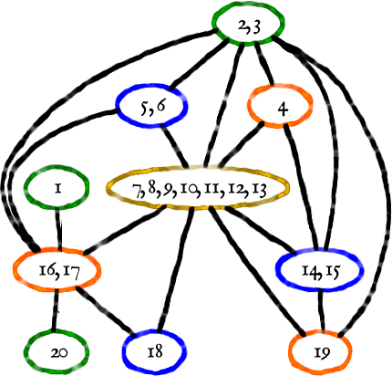

!SLIDE

# dobór U i V

<table class='lay' style='margin-top: 6em;'>
  <tr>
    <td>
      <ul>
        <li> liczba kombinacji przy <i>n</i> stanach i <i>k</i>-wejściowych komórkach FPGA</li>
        <li>algorytmy: wyczerpujący, ogólnej istotności wejść i unikalności dostarczanej informacji</li>
      </ul>
    </td>
    <td>
      

      
<i>c </i>(<i>n</i>) dla <i>k</i> = 4

    </td>
  </tr>
</table>

!SLIDE

# dobór U i V

<table class='uv'>
  <thead>
    <tr><th>automat</th><th><i>n</i></th><th colspan='7'>dostarczana część istotnej informacji (7 najistotniejszych wejść)</th></tr>
  </thead>
  <tbody>
    <tr><td>kirkman</td><td>12</td><td>26%</td><td>26%</td><td>25%</td><td>25%</td><td>23%</td><td>23%</td><td>23%</td></tr>
    <tr><td>s208</td><td>11</td><td>47%</td><td>43%</td><td>32%</td><td>12%</td><td>0,9%</td><td>0,2%</td><td>0,04%</td></tr>
    <tr><td>s420</td><td>19</td><td>49%</td><td>38%</td><td>25%</td><td>5%</td><td>1,2%</td><td>0,4%</td><td>0,2%</td></tr>
    <tr><td>s510</td><td>19</td><td>0,5%</td><td>0,4%</td><td>0,3%</td><td>0,3%</td><td>0,1%</td><td>0,1%</td><td>0,1%</td></tr>
    <tr><td>s820</td><td>18</td><td>51%</td><td>32%</td><td>27%</td><td>14%</td><td>0,4%</td><td>0,3%</td><td>0,3%</td></tr>
    <tr><td>s832</td><td>18</td><td>50%</td><td>32%</td><td>24%</td><td>17%</td><td>0,7%</td><td>0,4%</td><td>0,4%</td></tr>
    <tr><td>sand</td><td>11</td><td>32%</td><td>12%</td><td>12%</td><td>12%</td><td>12%</td><td>3%</td><td>2%</td></tr>
    <tr><td>scf</td><td>27</td><td>1,2%</td><td>0,4%</td><td>0,4%</td><td>0,4%</td><td>0,3%</td><td>0,2%</td><td>0,03%</td></tr>
  </tbody>
</table>

## dostarczana część istotnej informacji zależy od wejścia

!SLIDE

# konstrukcja βQU

## łączenie bloków nakrycia βQ w zależności od utraty informacji (wagi krawędzi grafu)

!SLIDE

# konstrukcja βG i βQV

## kolorowanie bloków nakrycia βQ na podstawie grafu niezgodności

!SLIDE

# konstrukcja βG i βQV

## kolorowanie bloków nakrycia βQ na podstawie grafu niezgodności

!SLIDE

# konstrukcja βG i βQV

## łączenie bloków nakrycia βQ na podstawie grafu niezgodności

!SLIDE

# konstrukcja βG i βQV

##  równoległa konstrukcja βG i βQV
