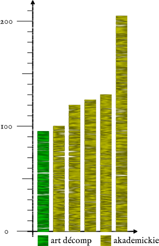

!SLIDE bullets

# wyniki

* dekompozycja dla trzech różnych architektur: układ z komórkami 4/1, układ z komórkami 5/1 oraz układ z komórkami 5/1 i 4/2

* porównanie z dwoma współczesnymi narzędziami komercyjnymi

* porównanie z wynikami z publikacji akademickich

!SLIDE

# komórki 4/1, narzędzie A

<table class='res'>
  <thead>
    <tr><th>automat</th><th>art décomp</th><th>one-hot</th><th>JEDI</th><th>random</th><th>NOVA</th></tr>
  </thead>
  <tbody>
    <tr><td>bbtas</td><td>8</td><td>9</td><td>9</td><td>9</td><td>9</td></tr>
    <tr><td>beecount</td><td>10</td><td>23</td><td>24</td><td>24</td><td>24</td></tr>
    <tr><td>dk27</td><td>5</td><td>8</td><td>8</td><td>8</td><td>8</td></tr>
    <tr><td>donfile</td><td>0</td><td>54</td><td>54</td><td>54</td><td>54</td></tr>
    <tr><td>ex3</td><td>9</td><td>16</td><td>16</td><td>16</td><td>16</td></tr>
    <tr><td>ex7</td><td>10</td><td>13</td><td>13</td><td>13</td><td>13</td></tr>
    <tr><td>lion</td><td>3</td><td>7</td><td>7</td><td>7</td><td>7</td></tr>
    <tr><td>lion9</td><td>3</td><td>17</td><td>16</td><td>16</td><td>17</td></tr>
    <tr><td>mc</td><td>9</td><td>10</td><td>10</td><td>10</td><td>10</td></tr>
    <tr><td>modulo12</td><td>0</td><td>0</td><td>0</td><td>0</td><td>0</td></tr>
    <tr><td>opus</td><td>24</td><td>28</td><td>28</td><td>28</td><td>28</td></tr>
    <tr><td>s27</td><td>7</td><td>22</td><td>22</td><td>22</td><td>22</td></tr>
    <tr><td>s8</td><td>0</td><td>17</td><td>17</td><td>17</td><td>17</td></tr>
    <tr><td>shiftreg</td><td>4</td><td>9</td><td>9</td><td>9</td><td>9</td></tr>
    <tr><td>train4</td><td>3</td><td>5</td><td>5</td><td>5</td><td>5</td></tr>
    <tr><td>train11</td><td>5</td><td>17</td><td>17</td><td>17</td><td>17</td></tr>
  </tbody>
  <tfoot>
    <tr><th>suma</th><th>100</th><th>255</th><th>255</th><th>255</th><th>256</th></tr>
  </tfoot>
</table>

!SLIDE

# komórki 4/1, narzędzie B, VHDL

<table class='res'>
  <thead>
    <tr><th>automat</th><th>art décomp</th><th>JEDI</th><th>NOVA</th><th>random</th><th>one-hot</th></tr>
  </thead>
  <tbody>
    <tr><td>bbtas</td><td>8</td><td>6</td><td>6</td><td>6</td><td>8</td></tr>
    <tr><td>beecount</td><td>10</td><td>23</td><td>24</td><td>25</td><td>51</td></tr>
    <tr><td>dk27</td><td>5</td><td>5</td><td>5</td><td>5</td><td>10</td></tr>
    <tr><td>donfile</td><td>0</td><td>0</td><td>0</td><td>0</td><td>0</td></tr>
    <tr><td>ex3</td><td>9</td><td>17</td><td>20</td><td>25</td><td>42</td></tr>
    <tr><td>ex7</td><td>10</td><td>23</td><td>23</td><td>18</td><td>38</td></tr>
    <tr><td>lion</td><td>3</td><td>3</td><td>3</td><td>3</td><td>5</td></tr>
    <tr><td>lion9</td><td>3</td><td>11</td><td>12</td><td>20</td><td>15</td></tr>
    <tr><td>mc</td><td>9</td><td>6</td><td>7</td><td>7</td><td>10</td></tr>
    <tr><td>modulo12</td><td>0</td><td>0</td><td>0</td><td>0</td><td>0</td></tr>
    <tr><td>opus</td><td>24</td><td>40</td><td>49</td><td>53</td><td>56</td></tr>
    <tr><td>s27</td><td>7</td><td>6</td><td>15</td><td>15</td><td>31</td></tr>
    <tr><td>s8</td><td>0</td><td>0</td><td>0</td><td>0</td><td>0</td></tr>
    <tr><td>shiftreg</td><td>4</td><td>4</td><td>3</td><td>4</td><td>9</td></tr>
    <tr><td>train4</td><td>3</td><td>3</td><td>3</td><td>3</td><td>4</td></tr>
    <tr><td>train11</td><td>5</td><td>17</td><td>18</td><td>22</td><td>39</td></tr>
  </tbody>
  <tfoot>
    <tr><th>suma</th><th>100</th><th>164</th><th>188</th><th>206</th><th>318</th></tr>
  </tfoot>
</table>

!SLIDE

# komórki 4/1, narzędzie B, AHDL

<table class='res'>
  <thead>
    <tr><th>automat</th><th>art décomp</th><th>JEDI</th><th>NOVA</th><th>random</th><th>one-hot</th></tr>
  </thead>
  <tbody>
    <tr><td>bbtas</td><td>8</td><td>6</td><td>6</td><td>6</td><td>9</td></tr>
    <tr><td>beecount</td><td>10</td><td>16</td><td>18</td><td>19</td><td>29</td></tr>
    <tr><td>dk27</td><td>5</td><td>5</td><td>5</td><td>5</td><td>8</td></tr>
    <tr><td>donfile</td><td>0</td><td>0</td><td>0</td><td>0</td><td>47</td></tr>
    <tr><td>ex3</td><td>9</td><td>22</td><td>31</td><td>32</td><td>16</td></tr>
    <tr><td>ex7</td><td>10</td><td>8</td><td>31</td><td>29</td><td>12</td></tr>
    <tr><td>lion</td><td>3</td><td>3</td><td>3</td><td>3</td><td>8</td></tr>
    <tr><td>lion9</td><td>3</td><td>15</td><td>20</td><td>31</td><td>20</td></tr>
    <tr><td>mc</td><td>9</td><td>6</td><td>7</td><td>8</td><td>10</td></tr>
    <tr><td>modulo12</td><td>0</td><td>0</td><td>0</td><td>0</td><td>0</td></tr>
    <tr><td>opus</td><td>24</td><td>29</td><td>30</td><td>38</td><td>34</td></tr>
    <tr><td>s27</td><td>7</td><td>5</td><td>15</td><td>14</td><td>21</td></tr>
    <tr><td>s8</td><td>0</td><td>1</td><td>1</td><td>1</td><td>21</td></tr>
    <tr><td>shiftreg</td><td>4</td><td>4</td><td>3</td><td>4</td><td>9</td></tr>
    <tr><td>train4</td><td>3</td><td>3</td><td>3</td><td>3</td><td>6</td></tr>
    <tr><td>train11</td><td>5</td><td>19</td><td>20</td><td>29</td><td>19</td></tr>
  </tbody>
  <tfoot>
    <tr><th>suma</th><th>100</th><th>155</th><th>193</th><th>222</th><th>269</th></tr>
  </tfoot>
</table>

!SLIDE

# komórki 5/1 i 4/2, narzędzie A

<table class='res' style='margin-top: -0.5em;'>
  <thead>
    <tr><th>automat</th><th>art décomp</th><th>JEDI</th><th>random</th><th>NOVA</th><th>one-hot</th></tr>
  </thead>
  <tbody>
    <tr><td>bbara</td><td>10</td><td>14</td><td>14</td><td>13</td><td>13</td></tr>
    <tr><td>bbtas</td><td>5</td><td>5</td><td>5</td><td>5</td><td>5</td></tr>
    <tr><td>beecount</td><td>7</td><td>13</td><td>12</td><td>12</td><td>12</td></tr>
    <tr><td>dk15</td><td>7</td><td>18</td><td>17</td><td>18</td><td>18</td></tr>
    <tr><td>dk17</td><td>6</td><td>8</td><td>9</td><td>10</td><td>11</td></tr>
    <tr><td>dk27</td><td>3</td><td>5</td><td>4</td><td>5</td><td>5</td></tr>
    <tr><td>dk512</td><td>7</td><td>10</td><td>11</td><td>11</td><td>10</td></tr>
    <tr><td>donfile</td><td>0</td><td>27</td><td>27</td><td>27</td><td>27</td></tr>
    <tr><td>ex3</td><td>7</td><td>9</td><td>9</td><td>9</td><td>9</td></tr>
    <tr><td>ex5</td><td>5</td><td>7</td><td>8</td><td>7</td><td>8</td></tr>
    <tr><td>ex6</td><td>16</td><td>20</td><td>20</td><td>20</td><td>20</td></tr>
    <tr><td>ex7</td><td>7</td><td>7</td><td>7</td><td>7</td><td>7</td></tr>
    <tr><td>lion</td><td>2</td><td>4</td><td>4</td><td>4</td><td>4</td></tr>
    <tr><td>lion9</td><td>2</td><td>10</td><td>10</td><td>11</td><td>11</td></tr>
    <tr><td>modulo12</td><td>0</td><td>0</td><td>0</td><td>0</td><td>0</td></tr>
    <tr><td>opus</td><td>12</td><td>16</td><td>16</td><td>16</td><td>17</td></tr>
    <tr><td>s27</td><td>4</td><td>11</td><td>11</td><td>11</td><td>11</td></tr>
    <tr><td>s8</td><td>0</td><td>9</td><td>9</td><td>9</td><td>9</td></tr>
    <tr><td>shiftreg</td><td>2</td><td>6</td><td>6</td><td>6</td><td>5</td></tr>
    <tr><td>train4</td><td>2</td><td>3</td><td>3</td><td>3</td><td>3</td></tr>
    <tr><td>train11</td><td>4</td><td>9</td><td>9</td><td>9</td><td>9</td></tr>
  </tbody>
  <tfoot>
    <tr><th>suma</th><th>108</th><th>211</th><th>211</th><th>213</th><th>214</th></tr>
  </tfoot>
</table>

!SLIDE

# komórki 5/1 i 4/2, SIS

<table class='res wide'>
  <thead>
    <tr><th>automat</th><th>art décomp</th><th>Secode</th><th>JEDI</th><th>NOVA -i</th><th>NOVA -io</th><th>MINISUP</th><th>one-hot</th></tr>
  </thead>
  <tbody>
    <tr><td>bbara</td><td>10</td><td>7</td><td>11</td><td>13</td><td>14</td><td>16</td><td>15</td></tr>
    <tr><td>bbtas</td><td>5</td><td>4</td><td>5</td><td>3</td><td>4</td><td>6</td><td>6</td></tr>
    <tr><td>beecount</td><td>7</td><td>6</td><td>9</td><td>8</td><td>9</td><td>8</td><td>12</td></tr>
    <tr><td>dk15</td><td>7</td><td>12</td><td>11</td><td>13</td><td>13</td><td>13</td><td>17</td></tr>
    <tr><td>dk17</td><td>6</td><td>10</td><td>11</td><td>9</td><td>11</td><td>13</td><td>17</td></tr>
    <tr><td>dk27</td><td>3</td><td>3</td><td>3</td><td>4</td><td>3</td><td>4</td><td>6</td></tr>
    <tr><td>lion</td><td>2</td><td>2</td><td>2</td><td>3</td><td>2</td><td>2</td><td>3</td></tr>
    <tr><td>s8</td><td>0</td><td>1</td><td>1</td><td>1</td><td>1</td><td>1</td><td>9</td></tr>
  </tbody>
  <tfoot>
    <tr><th>suma</th><th>40</th><th>45</th><th>53</th><th>54</th><th>57</th><th>63</th><th>85</th></tr>
  </tfoot>
</table>

!SLIDE

# komórki 5/1, IRMA2FPGA

<table class='res wide'>
  <thead>
    <tr><th>automat</th><th>art décomp</th><th>Secode</th><th>Gray</th><th>JEDI</th><th>sequential</th><th>one-hot</th></tr>
  </thead>
  <tbody>
    <tr><td>bbara</td><td>11</td><td>12</td><td>11</td><td>15</td><td>15</td><td>20</td></tr>
    <tr><td>bbtas</td><td>5</td><td>5</td><td>5</td><td>5</td><td>5</td><td>8</td></tr>
    <tr><td>beecount</td><td>8</td><td>6</td><td>8</td><td>9</td><td>10</td><td>13</td></tr>
    <tr><td>dk15</td><td>7</td><td>7</td><td>7</td><td>7</td><td>7</td><td>12</td></tr>
    <tr><td>dk17</td><td>6</td><td>6</td><td>6</td><td>6</td><td>6</td><td>16</td></tr>
    <tr><td>dk27</td><td>5</td><td>5</td><td>5</td><td>5</td><td>5</td><td>8</td></tr>
    <tr><td>dk512</td><td>7</td><td>7</td><td>7</td><td>7</td><td>7</td><td>19</td></tr>
    <tr><td>ex5</td><td>5</td><td>7</td><td>8</td><td>11</td><td>10</td><td>15</td></tr>
    <tr><td>ex6</td><td>17</td><td>21</td><td>29</td><td>24</td><td>29</td><td>25</td></tr>
    <tr><td>lion</td><td>3</td><td>3</td><td>3</td><td>3</td><td>3</td><td>5</td></tr>
    <tr><td>lion9</td><td>3</td><td>3</td><td>4</td><td>5</td><td>4</td><td>10</td></tr>
    <tr><td>mc</td><td>7</td><td>7</td><td>7</td><td>7</td><td>7</td><td>7</td></tr>
    <tr><td>s27</td><td>6</td><td>4</td><td>5</td><td>4</td><td>7</td><td>15</td></tr>
    <tr><td>s8</td><td>0</td><td>1</td><td>6</td><td>5</td><td>5</td><td>8</td></tr>
    <tr><td>shiftreg</td><td>4</td><td>4</td><td>4</td><td>4</td><td>4</td><td>9</td></tr>
    <tr><td>train11</td><td>4</td><td>3</td><td>7</td><td>6</td><td>7</td><td>13</td></tr>
  </tbody>
  <tfoot>
    <tr><th>suma</th><th>98</th><th>101</th><th>122</th><th>123</th><th>131</th><th>203</th></tr>
  </tfoot>
</table>

!SLIDE

# komórki 4/1, narzędzia komercyjne

!SLIDE

# komórki 5/1 i 4/2, narzędzia akademickie i komercyjne

!SLIDE

# komórki 5/1, narzędzia akademickie

