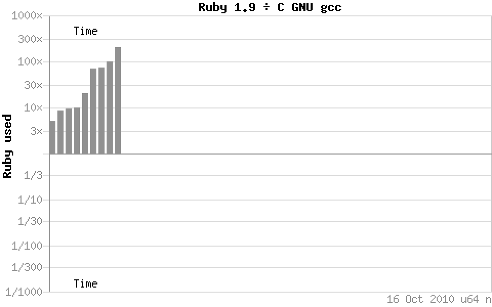

!SLIDE

# Ruby’s performance

!SLIDE

# Ruby’s “performance”

!SLIDE

!SLIDE

!SLIDE bullets incremental

* shootout
* .  alioth
* .  debian
* .  org

!SLIDE

!SLIDE

!SLIDE

!SLIDE

!SLIDE

!SLIDE bullets incremental

* ### but… but… benchmarks?
* ### srsly?

!SLIDE commandline incremental

	$ Synthetic benchmarks tell us sweet FA
	$ about real world performance of code,

	$ architecture

	$ being a much more significant consideration
	$ than the proportion of raw MIPS
	$ a given language will deliver on a given platform.

	$ The average netbook could happily run
	$ all of Teller’s fusion bomb models
	$ along with the full telemetry analysis
	$ of all the Apollo missions
	$ in the pauses between loading XKCD comics
	$ and binning junk mail
	$ without the user being any the wiser.

!SLIDE

