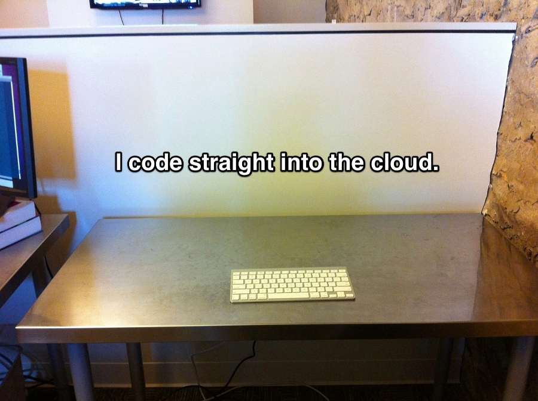

!SLIDE transition=scrollLeft
# it’s RubyConf 2011
## so let’s talk about Smalltalk

!SLIDE incremental
## Smalltalk: lovely _and_ quotable
* 
OOP to me means only messaging, local retention and protection and hiding of state-process, and extreme late-binding of all things. It can be done in Smalltalk and in Lisp. There are possibly other systems in which this is possible, but I’m not aware of them.   — Alan Kay

* 
I always thought Smalltalk would beat Java, I just didn’t know it would be called ‘Ruby’ when it did.   — Kent Beck

!SLIDE incremental
## Smalltalk: lovely _and_ quotable
* 
‘Ruby is like Smalltalk and Perl had a child.’ ‘I like to say that Ruby is the love child of Smalltalk and Lisp, raised by Perl the eccentric nanny.’ — Steve Klabnik and Josh Susser

* 
Smalltalk programmers do not type, they lean their heads towards their monitors, and meditate. The more advanced programmers do not even need monitors.   — Phlip

!SLIDE center transition=scrollRight

[Highgroove Studios: The Value of Reading Code](http://highgroove.com/articles/2011/07/26/value-of-reading-code.html)

!SLIDE bullets incremental transition=scrollLeft
# GemStone
* an object database for Smalltalk
* the company behind MagLev
* a Ruby implementation with integrated object persistence
* 
Now that people are considering NoSQL will more people consider no-database? — Martin Fowler

!SLIDE bullets incremental
# Ruby object databases
* [MagLev](http://maglev.gemstone.com) alpha since 2009
* [Madeleine](http://madeleine.rubyforge.org), [ODB](http://zeropluszero.com/software/odb), [HybridDB](https://github.com/pauliephonic/hybriddb) ☠ 2006, ☠ 2006, ☠ 2009
* [Cubbyhole](https://github.com/adelcambre/cubbyhole) marshalling on SDBM
* [ROD](https://github.com/apohllo/rod) not there _yet_, but interesting

!SLIDE center transition=scrollRight

[Meme Generator](http://memegenerator.net/instance/8402725)
