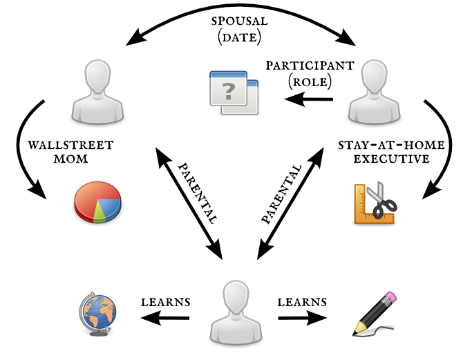

!SLIDE transition=scrollLeft
# sweet relations, how do they work?

!SLIDE center
# a relations example

!SLIDE center
# a relations example

!SLIDE bullets incremental transition=scrollLeft
# relations in relational (ha!) databases
* database ‘relations’ are between table **rows**
* one-to-many: foreign keys
* many-to-many: join tables
* dereferencing: join queries

!SLIDE bullets incremental
# relations in document databases
* embedded documents
* document identifier references
* MongoDB – implicit DBRef: `{ $ref: <collection>, $id: <object_id> }`
* dereferencing costs | [MongoHydrator](https://github.com/gregspurrier/mongo_hydrator)?

!SLIDE bullets incremental
# relations elsewhere
* key-value stores: explicit
* graph databases: the whole point of
* freely-labeled edges and vertices
* graph traversal! proximity metrics!

!SLIDE center

[Wikipedia: Graph database](http://en.wikipedia.org/wiki/Graph_database)

!SLIDE bullets incremental transition=scrollLeft
# if relations were objects
* a ‘relations’ table or collection
* very flexible in schema-less databases
* two-step dereferencing: object — its relations — their objects
* tonnes of easily-aggregable data

!SLIDE center
# relations as objects

!SLIDE incremental
# \o/   yay for names!   \o/
* 
There are only two industries that refer to their customers as ‘users’. — Edward Tufte

* 
Calling the table ‘people’, not ‘users’. A small blow in support of humanity. — Paul Battley

* read _[Personal names around the world](http://www.w3.org/International/questions/qa-personal-names)_

!SLIDE center
# relations as objects

!SLIDE center transition=scrollRight

[Kontraband: If Corgis Could Write Love Poems…](http://www.kontraband.com/pics/27528/If-Corgis-Could-Write-Love-Poems)
