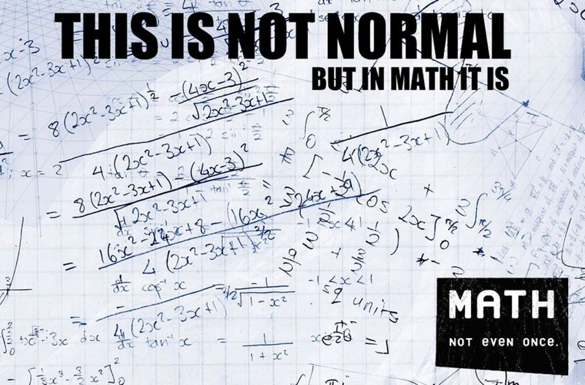

!SLIDE

# benchmarking

!SLIDE bullets incremental

# Project Euler

* the sum of the primes below 10 is 2 + 3 + 5 + 7 = 17

* find the sum of all the primes below two million

!SLIDE

[drugs.soup.io / post / 54096687 / This-is-not-normal-but-in-math](http://drugs.soup.io/post/54096687/This-is-not-normal-but-in-math)

!SLIDE

    @@@ Ruby
    class Integer

      def prime?
        # …
      end

    end

    puts (2...2_000_000).select(&:prime?).inject :+

!SLIDE

    @@@ Ruby
    class Integer

      def stupid_prime?
        prime = true
        (2...self).each { |i| prime = false if (self % i).zero? }
        prime
      end

    end

!SLIDE

    @@@ Ruby
    class Integer

      def tedious_prime?
        (2...self).all? { |i| (self % i).nonzero? }
      end

    end

!SLIDE

    @@@ Ruby
    class Integer

      def simple_prime?
        (2..Math.sqrt(self).floor).all? { |i| (self % i).nonzero? }
      end

    end

!SLIDE bullets incremental

* cool story, bro, but…
* `require 'prime'`
* gives us
* Integer#prime?
* like, already.

!SLIDE

    @@@ Ruby
    class Integer

      def simple_prime?
        (2..Math.sqrt(self).floor).all? { |i| (self % i).nonzero? }
      end

    end

!SLIDE

    @@@ Ruby
    require 'benchmark'
    require 'prime'
    require './euler-primes'

    Benchmark.bmbm do |bench|
      bench.report 'stupid:' do
        (2..10_000).each { |i| i.stupid_prime? }
      end
      bench.report 'tedious:' do
        (2..10_000).each { |i| i.tedious_prime? }
      end
      bench.report 'simple:' do
        (2..10_000).each { |i| i.simple_prime? }
      end
      bench.report 'clever:' do
        (2..10_000).each { |i| i.clever_prime? }
      end
      bench.report 'stdlib:' do
        (2..10_000).each { |i| i.prime? }
      end
    end

!SLIDE commandline incremental

    $ ruby benchmark.rb
    Rehearsal --------------------------------------------
    stupid:   13.080000   0.000000  13.080000 ( 13.107838)
    tedious:   2.090000   0.000000   2.090000 (  2.092263)
    simple:    0.070000   0.000000   0.070000 (  0.069488)
    clever:    0.040000   0.000000   0.040000 (  0.043665)
    stdlib:    0.150000   0.000000   0.150000 (  0.145920)
    ---------------------------------- total: 15.430000sec

                   user     system      total        real
    stupid:   13.030000   0.000000  13.030000 ( 13.061577)
    tedious:   2.080000   0.000000   2.080000 (  2.089508)
    simple:    0.070000   0.000000   0.070000 (  0.067561)
    clever:    0.040000   0.000000   0.040000 (  0.038180)
    stdlib:    0.140000   0.000000   0.140000 (  0.145690)

!SLIDE

    @@@ Ruby
    require 'benchmark'
    require 'prime'
    require './euler-primes'

    Benchmark.bmbm do |bench|
      bench.report 'simple:' do
        (2..100_000).each { |i| i.simple_prime? }
      end
      bench.report 'clever:' do
        (2..100_000).each { |i| i.clever_prime? }
      end
      bench.report 'stdlib:' do
        (2..100_000).each { |i| i.prime? }
      end
    end

!SLIDE commandline incremental

    $ ruby benchmark-stdlib.rb
    Rehearsal -------------------------------------------
    simple:   1.190000   0.000000   1.190000 (  1.195284)
    clever:   0.660000   0.010000   0.670000 (  0.664936)
    stdlib:   2.210000   0.000000   2.210000 (  2.220644)
    ---------------------------------- total: 4.070000sec

                  user     system      total        real
    simple:   1.180000   0.000000   1.180000 (  1.184010)
    clever:   0.660000   0.000000   0.660000 (  0.661777)
    stdlib:   2.210000   0.000000   2.210000 (  2.221904)

!SLIDE

    @@@ Ruby
    class Integer

      def simple_prime?
        (2..Math.sqrt(self).floor).all? { |i| (self % i).nonzero? }
      end

    end

!SLIDE

    @@@ Ruby
    class Integer

      def simple_prime?
        (2..Math.sqrt(self).floor).all? { |i| (self % i).nonzero? }
      end

      # 173.simple_prime? goes from 2 to 13

    end

!SLIDE

    @@@ Ruby
    class Integer

      def simple_prime?
        (2..Math.sqrt(self).floor).all? { |i| (self % i).nonzero? }
      end

      # 173.simple_prime? goes from 2 to 13
      # …checking (among others) divisibility by 2, 4, 6, 8, 10, 12…

    end

!SLIDE

    @@@ Ruby
    class Integer

      def simple_prime?
        (2..Math.sqrt(self).floor).all? { |i| (self % i).nonzero? }
      end

      def clever_prime?
        return true  if self == 2
        return false if self.even?
        3.step(Math.sqrt(self).floor, 2).all? { |i| (self % i).nonzero? }
      end

    end
