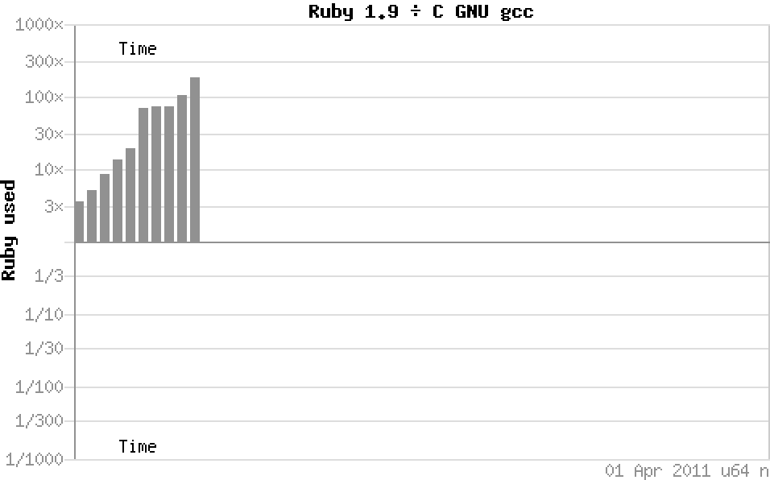

!SLIDE

# Ruby’s performance

!SLIDE

# Ruby’s ‘performance’

!SLIDE

[www.futures.hawaii.edu / 2008 / 09 / dator-on-slow-food.php](http://www.futures.hawaii.edu/2008/09/dator-on-slow-food.php)

!SLIDE

[slowfoodaustralia.com.au / events / national / a-taste-of-slow](http://slowfoodaustralia.com.au/events/national/a-taste-of-slow/)

!SLIDE bullets incremental

* shootout
* .  alioth
* .  debian
* .  org

!SLIDE

!SLIDE

!SLIDE

!SLIDE

!SLIDE

[www.computerrepairmaintenance.com / computer-help / what-can-i-do-to-fix-my-slow-computer](http://www.computerrepairmaintenance.com/computer-help/what-can-i-do-to-fix-my-slow-computer)

!SLIDE bullets incremental

* ### but… but… benchmarks?
* ### srsly?

!SLIDE bullets incremental

* Synthetic benchmarks tell us sweet FA about real world performance of code,

* architecture

* being a much more significant consideration than the proportion of raw MIPS a given language will deliver on a given platform.

!SLIDE bullets incremental

* The average netbook could happily run all of Teller’s fusion bomb models

* along with the full telemetry analysis of all the Apollo missions

* in the pauses between loading XKCD comics

* and binning junk mail

* without the user being any the wiser.

!SLIDE

[www.flickr.com / photos / gavinbell / 244169511](http://www.flickr.com/photos/gavinbell/244169511)
