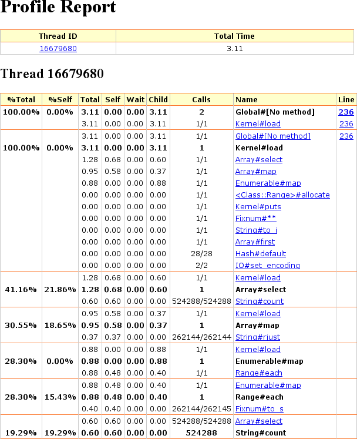
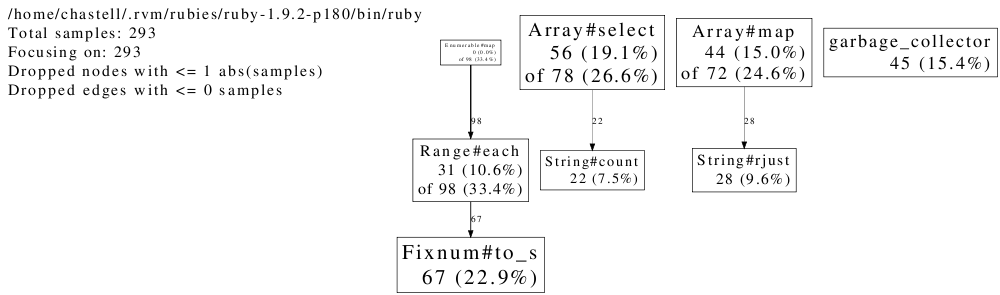
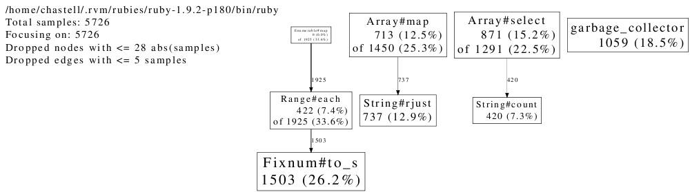
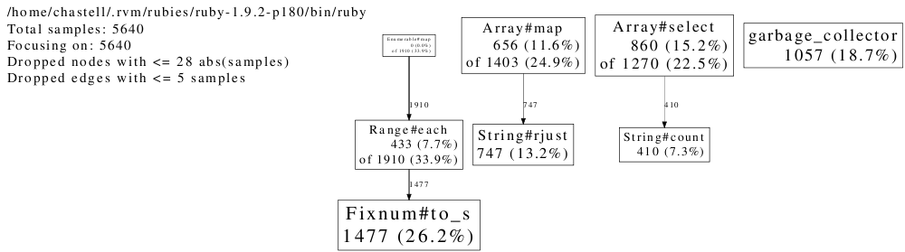
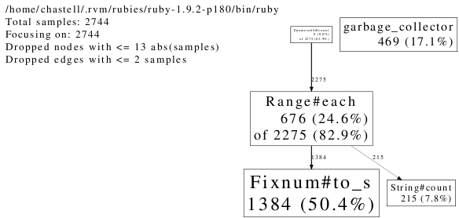
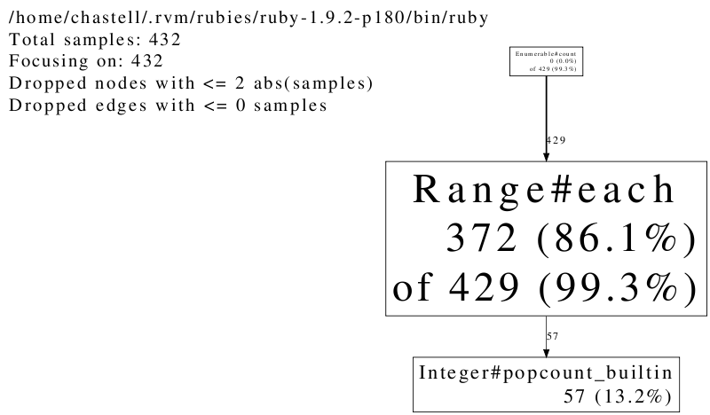

!SLIDE

# profiling Ruby

!SLIDE

[en.wikipedia.org / wiki / Leonhard_Euler](http://en.wikipedia.org/wiki/Leonhard_Euler)

!SLIDE bullets incremental

# Project Euler

* starting in the top left corner of a 2×2 grid, there are 6 routes (without backtracking) to the bottom right corner:

* 

* how many routes are there through a 20×20 grid?

!SLIDE bullets incremental

* only right and down

* so, let’s say… zeroes and ones?

* 0011, 0101, 0110, 1001, 1010, 1100

* all (2+2)-digit binary numbers with the same number of ones and zeroes

!SLIDE

    @@@ Ruby

    grid = 2

!SLIDE

    @@@ Ruby

    grid = 2

    (0...2**(2 * grid))                          # (0-15)

!SLIDE

    @@@ Ruby

    grid = 2

    (0...2**(2 * grid))                          # (0-15)
    .map { |n| n.to_s 2 }                        # ['0', '1', '10', '11'…]

!SLIDE

    @@@ Ruby

    grid = 2

    (0...2**(2 * grid))                          # (0-15)
    .map { |n| n.to_s 2 }                        # ['0', '1', '10', '11'…]
    .map { |s| s.rjust 2 * grid, '0' }           # ['0000','0001','0010'…]

!SLIDE

    @@@ Ruby

    grid = 2

    (0...2**(2 * grid))                          # (0-15)
    .map { |n| n.to_s 2 }                        # ['0', '1', '10', '11'…]
    .map { |s| s.rjust 2 * grid, '0' }           # ['0000','0001','0010'…]
    .select { |s| s.count('1') == s.count('0') } # ['0011','0101','0110'…]

!SLIDE

    @@@ Ruby

    grid = 2

    (0...2**(2 * grid))                          # (0-15)
    .map { |n| n.to_s 2 }                        # ['0', '1', '10', '11'…]
    .map { |s| s.rjust 2 * grid, '0' }           # ['0000','0001','0010'…]
    .select { |s| s.count('1') == s.count('0') } # ['0011','0101','0110'…]
    .size                                        # 6

!SLIDE

    @@@ Ruby
    # ruby grid.rb <number>

    grid = ARGV.first.to_i

    puts (0...2**(2 * grid))
    .map { |n| n.to_s 2 }
    .map { |s| s.rjust 2 * grid, '0' }
    .select { |s| s.count('1') == s.count('0') }
    .size

!SLIDE commandline incremental

    $ ruby grid.rb 2
    6

    $ ruby grid.rb 20
    ^Cgrid.rb:2:in `block in <main>': Interrupt
      from grid.rb:2:in `each'
      from grid.rb:2:in `map'
      from grid.rb:2:in `<main>'

    $ time ruby grid.rb 2
    6
    real 0m0.017s
    user 0m0.020s
    sys  0m0.000s

    $ time ruby grid.rb 8
    12870
    real 0m0.204s
    user 0m0.180s
    sys  0m0.020s

    $ time ruby grid.rb 10
    184756
    real 0m3.040s
    user 0m2.890s
    sys  0m0.130s

    $ time ruby grid.rb 11
    705432
    real 0m13.291s
    user 0m12.750s
    sys  0m0.490s

!SLIDE

[icanhascheezburger.com / 2011 / 03 / 18 / funny-pictures-before-microscopes](http://icanhascheezburger.com/2011/03/18/funny-pictures-before-microscopes/)

!SLIDE

# `require 'profile'`

!SLIDE commandline incremental

    $ time ruby grid.rb 9
    48620
    real 0m0.827s
    user 0m0.780s
    sys  0m0.040s

    $ time ruby -r profile grid.rb 9
    48620
      %   cumulative   self              self     total
     time   seconds   seconds    calls  ms/call  ms/call  name
     32.38    12.64     12.64        1 12640.00 18570.00  Array#select
     23.64    21.87      9.23        1  9230.00 13610.00  Array#map
     12.09    26.59      4.72        1  4720.00  6840.00  Range#each
     10.04    30.51      3.92   524288     0.01     0.01  String#count
      6.25    32.95      2.44   262144     0.01     0.01  String#rjust
      5.43    35.07      2.12   262145     0.01     0.01  Fixnum#to_s
      5.15    37.08      2.01   262144     0.01     0.01  Fixnum#==
      4.97    39.02      1.94   262145     0.01     0.01  Fixnum#*
      0.05    39.04      0.02        2    10.00    10.00  IO#write
      0.00    39.04      0.00        2     0.00     0.00  IO#set_encoding
      0.00    39.04      0.00        1     0.00  6840.00  Enumerable.map
      0.00    39.04      0.00        1     0.00     0.00  Fixnum#**
      0.00    39.04      0.00        1     0.00     0.00  String#to_i
      0.00    39.04      0.00        1     0.00     0.00  Array#first
      0.00    39.04      0.00        1     0.00     0.00  Array#size
      0.00    39.04      0.00       28     0.00     0.00  Hash#default
      0.00    39.04      0.00        1     0.00    20.00  IO#puts
      0.00    39.04      0.00        1     0.00    20.00  Kernel.puts
      0.00    39.04      0.00        1     0.00 39040.00  #toplevel
    real 0m40.984s
    user 0m39.080s
    sys  0m1.260s

!SLIDE

[www.anchor.com.au / blog / 2009 / 10 / ooh-bugger](http://www.anchor.com.au/blog/2009/10/ooh-bugger/)

!SLIDE

# gem install ruby-prof

!SLIDE commandline incremental

    $ time ruby-prof grid.rb 9
    48620
    Thread ID: 14590720
    Total: 3.150000

     %self     total     self     wait    child    calls  name
     22.86      1.30     0.72     0.00     0.58        1  Array#select
     18.41      0.58     0.58     0.00     0.00   524288  String#count
     17.14      0.89     0.54     0.00     0.35        1  Range#each
     15.87      0.96     0.50     0.00     0.46        1  Array#map
     14.60      0.46     0.46     0.00     0.00   262144  String#rjust
     11.11      0.35     0.35     0.00     0.00   262145  Fixnum#to_s
      0.00      0.00     0.00     0.00     0.00        2  IO#write
      0.00      0.00     0.00     0.00     0.00        1  IO#puts
      0.00      0.00     0.00     0.00     0.00        1  Kernel#puts
      0.00      0.89     0.00     0.00     0.89        1  Enumerable#map
      0.00      0.00     0.00     0.00     0.00        1  <Class::Range>#allocate
      0.00      0.00     0.00     0.00     0.00        1  Fixnum#**
      0.00      0.00     0.00     0.00     0.00        1  String#to_i
      0.00      0.00     0.00     0.00     0.00        1  Array#first
      0.00      0.00     0.00     0.00     0.00       28  Hash#default
      0.00      0.00     0.00     0.00     0.00        2  IO#set_encoding
      0.00      3.15     0.00     0.00     3.15        1  Kernel#load
      0.00      3.15     0.00     0.00     3.15        2  Global#[No method]

    real 0m3.425s
    user 0m2.560s
    sys  0m0.830s

    $ ruby-prof -p graph_html -f grid.html grid.rb 9
    48620

!SLIDE

!SLIDE

[www.anchor.com.au / blog / 2009 / 10 / ooh-bugger](http://www.anchor.com.au/blog/2009/10/ooh-bugger/)

!SLIDE

# gem install perftools.rb

!SLIDE commandline incremental

    $ export CPUPROFILE=grid

    $ time ruby -r perftools grid.rb 9
    48620
    PROFILE: interrupts/evictions/bytes = 76/0/272

    real 0m0.928s
    user 0m0.830s
    sys  0m0.090s

    $ pprof.rb --text grid
    Using local file /home/chastell/.rvm/rubies/ruby-1.9.2-p180/bin/ruby.
    Using local file grid.
    Total: 76 samples
          16  21.1%  21.1%       16  21.1% garbage_collector
          12  15.8%  36.8%       12  15.8% String#count
          11  14.5%  51.3%       11  14.5% Fixnum#to_s
          10  13.2%  64.5%       22  28.9% Array#select
          10  13.2%  77.6%       21  27.6% Range#each
          10  13.2%  90.8%       10  13.2% String#rjust
           7   9.2% 100.0%       17  22.4% Array#map
           0   0.0% 100.0%       21  27.6% Enumerable#map

!SLIDE commandline incremental

    $ time ruby grid.rb 10
    184756

    real 0m3.082s
    user 0m2.910s
    sys  0m0.150s

    $ time ruby -r perftools grid.rb 10
    184756
    PROFILE: interrupts/evictions/bytes = 293/0/272

    real 0m3.189s
    user 0m2.940s
    sys  0m0.230s

    $ pprof.rb --text grid
    Using local file /home/chastell/.rvm/rubies/ruby-1.9.2-p180/bin/ruby.
    Using local file grid.
    Total: 293 samples
          67  22.9%  22.9%       67  22.9% Fixnum#to_s
          56  19.1%  42.0%       78  26.6% Array#select
          45  15.4%  57.3%       45  15.4% garbage_collector
          44  15.0%  72.4%       72  24.6% Array#map
          31  10.6%  82.9%       98  33.4% Range#each
          28   9.6%  92.5%       28   9.6% String#rjust
          22   7.5% 100.0%       22   7.5% String#count
           0   0.0% 100.0%       98  33.4% Enumerable#map

    $ pprof.rb --pdf grid > grid.pdf
    Using local file /home/chastell/.rvm/rubies/ruby-1.9.2-p180/bin/ruby.
    Using local file grid.
    Dropping nodes with <= 1 samples; edges with <= 0 abs(samples)

!SLIDE

# `$ ruby -r perftools grid.rb 10`

!SLIDE

# `$ ruby -r perftools grid.rb 11`

!SLIDE

# `$ ruby -r perftools grid.rb 12`

!SLIDE

    @@@ Ruby
    grid = ARGV.first.to_i

    puts (0...2**(2 * grid))
    .map { |n| n.to_s 2 }
    .map { |s| s.rjust 2 * grid, '0' }
    .select { |s| s.count('1') == s.count('0') }
    .size

!SLIDE

    @@@ Ruby
    grid = ARGV.first.to_i

    puts (0...2**(2 * grid))
    .map { |n| n.to_s 2 }
    .select { |s| s.count('1') == grid }
    .size

!SLIDE

    @@@ Ruby
    grid = ARGV.first.to_i

    puts (0...2**(2 * grid))
    .select { |n| n.to_s(2).count('1') == grid }
    .size

!SLIDE

    @@@ Ruby
    grid = ARGV.first.to_i

    puts (0...2**(2 * grid))
    .count { |n| n.to_s(2).count('1') == grid }

!SLIDE commandline

 
 
 

    $ time ruby -r perftools grid.rb 12
    2704156
    PROFILE: interrupts/evictions/bytes = 5640/0/272

    real 0m57.870s
    user 0m55.000s
    sys  0m2.690s

!SLIDE commandline

 
 
 

    $ time ruby -r perftools grid-short.rb 12
    2704156
    PROFILE: interrupts/evictions/bytes = 2744/0/200

    real 0m27.676s
    user 0m27.420s
    sys  0m0.130s

!SLIDE

# Westheimer’s Discovery

## a couple of months in the laboratory can frequently save a couple of hours in the library

!SLIDE

[sfwchan.com / ?id=4823](http://sfwchan.com/?id=4823)

!SLIDE

[www.etsy.com / listing / 62235991 / i-like-big-books-canvas-tote-bag](http://www.etsy.com/listing/62235991/i-like-big-books-canvas-tote-bag)

!SLIDE

    @@@ Ruby
    class Integer
      def popcount_to_s
        to_s(2).count '1'
      end
    end

    grid = ARGV.first.to_i
    puts (0...2**(2 * grid)).count { |n| n.popcount_to_s == grid }

    $ time ruby grid-classy.rb 12
    2704156
    real 0m26.562s
    user 0m26.370s
    sys  0m0.100s

!SLIDE

    @@@ Ruby
    class Integer
      def popcount_bitshift
        count = 0
        number = self
        while number > 0
          number &= number - 1
          count += 1
        end
        count
      end
    end

    grid = ARGV.first.to_i
    puts (0...2**(2 * grid)).count { |n| n.popcount_bitshift == grid }

!SLIDE

    @@@ Ruby
    class Integer
      def popcount_bitshift
        count = 0
        number = self
        while number > 0
          number &= number - 1
          count += 1
        end
        count
      end
    end

    grid = ARGV.first.to_i
    puts (0...2**(2 * grid)).count { |n| n.popcount_bitshift == grid }

    $ time ruby grid-bitshift.rb 12
    2704156
    real 0m33.155s
    user 0m33.010s
    sys  0m0.010s

!SLIDE commandline

!SLIDE

    @@@ Ruby
    require 'inline'
    class Integer
      inline do |builder|
        builder.c '
          int popcount_bitshift_c() {
            long number = NUM2LONG(self);
            int count;
            for (count = 0; number; count++) number &= number - 1;
            return count;
          }
        '
      end
    end

    grid = ARGV.first.to_i
    puts (0...2**(2 * grid)).count { |n| n.popcount_bitshift_c == grid }

!SLIDE

    @@@ Ruby
    require 'inline'
    class Integer
      inline do |builder|
        builder.c '
          int popcount_bitshift_c() {
            long number = NUM2LONG(self);
            int count;
            for (count = 0; number; count++) number &= number - 1;
            return count;
          }
        '
      end
    end

    grid = ARGV.first.to_i
    puts (0...2**(2 * grid)).count { |n| n.popcount_bitshift_c == grid }

    $ time ruby grid-bitshift-c.rb 12
    2704156
    real 0m4.649s
    user 0m4.590s
    sys  0m0.040s

!SLIDE

    @@@ Ruby
    require 'inline'
    class Integer
      inline do |builder|
        builder.c '
          int popcount_builtin() {
            return __builtin_popcountl(NUM2LONG(self));
          }
        '
      end
    end

    grid = ARGV.first.to_i
    puts (0...2**(2 * grid)).count { |n| n.popcount_builtin == grid }

    $ time ruby grid-builtin.rb 12
    2704156
    real 0m4.559s
    user 0m4.390s
    sys  0m0.110s

!SLIDE commandline

!SLIDE

# Westheimer’s Discovery

## a couple of months in the laboratory can frequently save a couple of hours in the library

!SLIDE

[www.weakstream.us / ?attachment_id=8226](http://www.weakstream.us/?attachment_id=8226)

!SLIDE bullets incremental

* we want to make `2 × grid` steps by combining `grid` right and `grid` down ones

* pick `grid` elements from a set of `2 × grid` elements

* number of such combinations is known: it’s the binomial coefficient of `2 × grid` over `grid`

* it’s equal to `(2 × grid)! / (grid! × (2 × grid - grid)!)`

* for `grid = 2` it’s `4! / (2! × (4 - 2)!)`

* for `grid = 20` it’s `40! / (20! × (40 - 20)!)`

* `(40 × 39 × … × 21) / (20 × 19 × … × 1) = 137,846,528,820`
