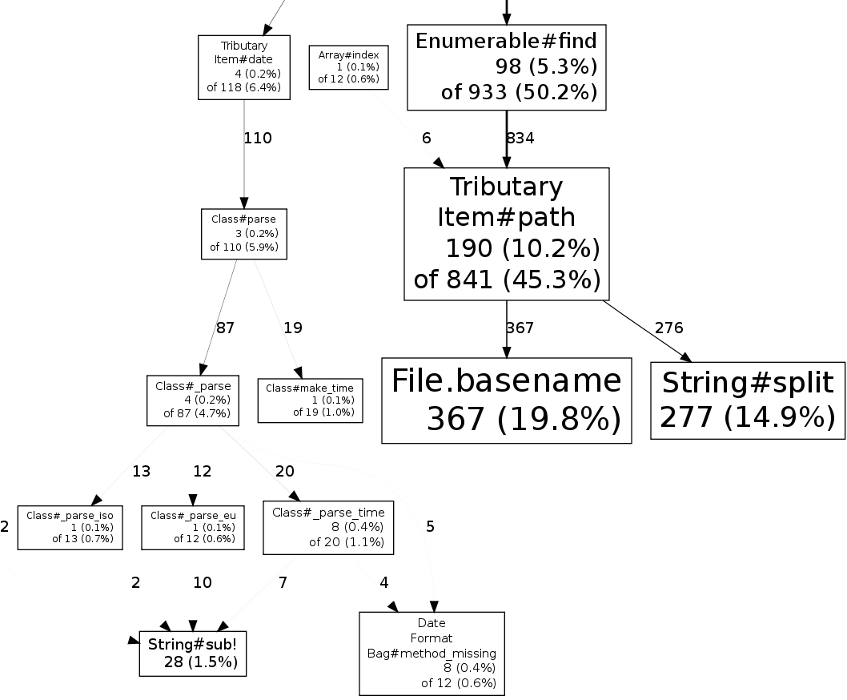

!SLIDE bullets incremental

# algorithms are hard – let’s go caching

* (…and now you have two problems)

!SLIDE bullets incremental

# profiling web applications

* Rack-based for starters
* (Rails is Rack-based)
* Sinatra app + Rack server
* tributary: a tiny blogging engine (yay!)
* let’s ApacheBench an install with many items

!SLIDE commandline incremental

    $ export CPUPROFILE=profile

    $ rackup -r perftools
    [2010-10-21 14:59:39] INFO  WEBrick 1.3.1
    [2010-10-21 14:59:39] INFO  ruby 1.9.2 (2010-08-18) [x86_64-linux]
    [2010-10-21 14:59:39] INFO  WEBrick::HTTPServer#start: pid=346 port=9292
    […]

    $ ab -n 10 http://localhost:9292/
    This is ApacheBench, Version 2.3 <$Revision: 655654 $>
    […]
    Time taken for tests:   66.078 seconds
    […]
    Requests per second:    0.15 [#/sec] (mean)
    Time per request:       6607.803 [ms] (mean)
    Time per request:       6607.803 [ms] (mean, across all concurrent requests)
    Transfer rate:          0.41 [Kbytes/sec] received

    Connection Times (ms)
                  min  mean[+/-sd] median   max
    Connect:        0    0   0.0      0       0
    Processing:  6536 6608 105.3   6581    6879
    Waiting:     6535 6607 105.3   6581    6878
    Total:       6536 6608 105.4   6581    6879
    […]

    $ pprof.rb --pdf profile > profile.pdf
    Dropping nodes with <= 33 samples; edges with <= 6 abs(samples)

!SLIDE

!SLIDE

!SLIDE

    @@@Ruby
    module Tributary class Item < OpenStruct

      def date
        case @table[:date]
        when Date   then @table[:date].to_time
        when String then Time.parse @table[:date]
        when Time   then @table[:date]
        end
      end

    end end

!SLIDE

    @@@Ruby
    module Tributary class Item < OpenStruct

      def date
        @date ||= case @table[:date]
                  when Date   then @table[:date].to_time
                  when String then Time.parse @table[:date]
                  when Time   then @table[:date]
                  end
      end

    end end

!SLIDE commandline incremental

    $ ab -n 10 http://localhost:9292/
    […]
    Time taken for tests:   18.525 seconds
    […]
    Requests per second:    0.54 [#/sec] (mean)
    Time per request:       1852.549 [ms] (mean)
    Time per request:       1852.549 [ms] (mean, across all concurrent requests)
    Transfer rate:          1.46 [Kbytes/sec] received

    Connection Times (ms)
                  min  mean[+/-sd] median   max
    Connect:        0    0   0.0      0       0
    Processing:  1797 1852 102.2   1819    2140
    Waiting:     1797 1852 102.2   1819    2140
    Total:       1797 1852 102.2   1819    2140

    Percentage of the requests served within a certain time (ms)
      50%   1819
      66%   1837
      75%   1840
      80%   1846
      90%   2140
      95%   2140
      98%   2140
      99%   2140
     100%   2140 (longest request)

    $ pprof.rb --pdf profile > profile.pdf
    Dropping nodes with <= 9 samples; edges with <= 1 abs(samples)

!SLIDE

!SLIDE

!SLIDE

    @@@Ruby
    module Tributary class Item < OpenStruct

      def path
        File.basename(@file, '.md').split('.').first
      end

    end end

!SLIDE

    @@@Ruby
    module Tributary class Item < OpenStruct

      def path
        @path ||= File.basename(@file, '.md').split('.').first
      end

    end end

!SLIDE commandline incremental

    $ ab -n 10 http://localhost:9292/
    […]
    Time taken for tests:   4.298 seconds
    […]
    Requests per second:    2.33 [#/sec] (mean)
    Time per request:       429.797 [ms] (mean)
    Time per request:       429.797 [ms] (mean, across all concurrent requests)
    Transfer rate:          6.28 [Kbytes/sec] received

    Connection Times (ms)
                  min  mean[+/-sd] median   max
    Connect:        0    0   0.0      0       0
    Processing:   390  430 103.3    401     723
    Waiting:      390  429 103.3    400     723
    Total:        390  430 103.4    401     724

    Percentage of the requests served within a certain time (ms)
      50%    401
      66%    401
      75%    403
      80%    403
      90%    724
      95%    724
      98%    724
      99%    724
     100%    724 (longest request)

    $ pprof.rb --pdf profile > profile.pdf
    Dropping nodes with <= 9 samples; edges with <= 1 abs(samples)

!SLIDE

!SLIDE

!SLIDE

# but what if we actually cached the whole item stream…?

!SLIDE commandline incremental

    $ ab -n 10 http://localhost:9292/
    […]
    Time taken for tests:   0.919 seconds
    […]
    Requests per second:    10.88 [#/sec] (mean)
    Time per request:       91.883 [ms] (mean)
    Time per request:       91.883 [ms] (mean, across all concurrent requests)
    Transfer rate:          29.37 [Kbytes/sec] received

    Connection Times (ms)
                  min  mean[+/-sd] median   max
    Connect:        0    0   0.2      0       1
    Processing:    22   92 191.9     37     637
    Waiting:       22   91 191.9     36     637
    Total:         22   92 192.1     37     638

    Percentage of the requests served within a certain time (ms)
      50%     37
      66%     39
      75%     39
      80%     45
      90%    638
      95%    638
      98%    638
      99%    638
     100%    638 (longest request)

!SLIDE

# …and un-cached Item#date and Item#path?

!SLIDE commandline incremental

    $ ab -n 10 http://localhost:9292/
    […]
    Time taken for tests:   7.116 seconds
    […]
    Requests per second:    1.41 [#/sec] (mean)
    Time per request:       711.577 [ms] (mean)
    Time per request:       711.577 [ms] (mean, across all concurrent requests)
    Transfer rate:          3.79 [Kbytes/sec] received

    Connection Times (ms)
                  min  mean[+/-sd] median   max
    Connect:        0    0   0.1      0       0
    Processing:    31  711 2119.9     44    6745
    Waiting:       30  711 2119.9     43    6745
    Total:         31  712 2120.0     44    6745

    Percentage of the requests served within a certain time (ms)
      50%     44
      66%     44
      75%     44
      80%     44
      90%   6745
      95%   6745
      98%   6745
      99%   6745
     100%   6745 (longest request)
