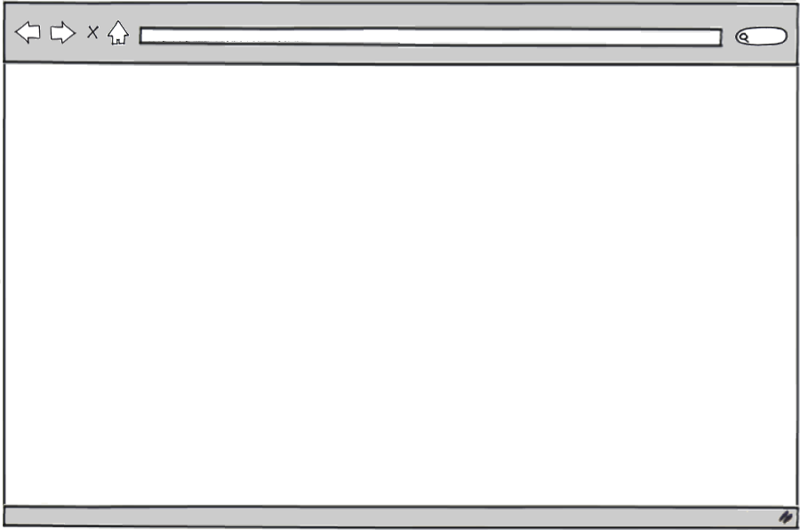

!SLIDE bullets incremental

# Internet: how does it work?

* well, I sit at my computer…
* …or a laptop…
* …or a tablet…
* …or a phone…
* …and, um, browse websites!

!SLIDE

# Internet: how does it work?

!SLIDE

# Internet: how does it work?

!SLIDE

# Internet: how does it work?

!SLIDE bullets incremental

# Internet: not only WWW

* there are other Internet services:
* email
* chat
* voice &amp; video
* (and other still)

!SLIDE

# client-server model

!SLIDE bullets incremental

# client-server model

* browser, email, chat: client
* ‘somewhere over there’: server
* various protocols: HTTP, IMAP, XMPP
* request / response cycle
* ‘live’ interaction somewhat simulated

!SLIDE bullets incremental

# WWW: HTML over HTTP

* World Wide Web
* =
* HyperText Transfer Protocol
* +
* HyperText Markup Language

!SLIDE bullets incremental

# WWW: how does it work?

* user comes up with a URL
* puts `www.pw.edu.pl/mapa` in a browser
* browser to DNS: ‘where is `www.pw.edu.pl`?’
* DNS to browser: ‘there: 194.29.151.5’
* browser to 194.29.151.5: ‘HTML for `/mapa`?’

!SLIDE

# WWW: how does it work?

!SLIDE bullets incremental

# WWW: how does it work?

* user goes to a search engine
* types it the query
* clicks on the results
* clicks further
* WWW: hyperlinked HTML pages
