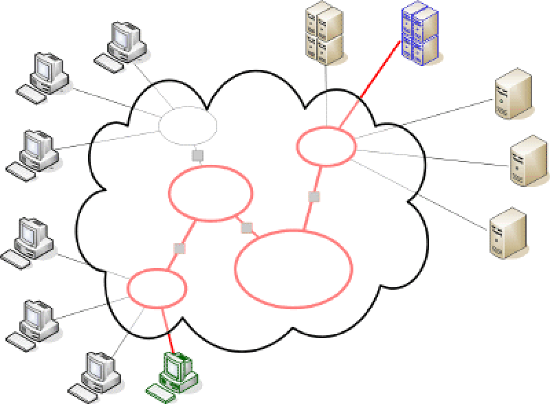

!SLIDE bullets incremental

# your own website

* your own domain name
* your own server + broadband connection
* (or hired hosting)
* actual content to display
* a way to manage this content

!SLIDE bullets incremental

# your own website

* static / dynamic content
* (embedded?) multimedia
* contact?
* comments?
* user-generated content?

!SLIDE bullets incremental

# traffic sources

* via URLs
* via ad campaigns
* via links on affiliate pages
* via social networks
* via search engines

!SLIDE bullets incremental

# staff needed

* webdeveloper
* graphic designer
* UI / accessibility experts?
* SEO expert?
* crowdsourcing / folksonomy?

!SLIDE bullets incremental

# tools & technical details

* which Content Management System?
* Flash or HTML5?
* which server stack?
* different media types / devices?
* particular user groups?

!SLIDE bullets incremental

# Internet, again

!SLIDE bullets incremental

# hired hosting

* usually takes care of the domain
* offers a CMS
* …or an easy way to setup one
* upload WordPress or Drupal
* choose a theme and you’re set

!SLIDE bullets incremental

# Software as a Service

* CMS is a web application
* example: WordPress.com
* `*.wordpress.com` domain: free
* own domain &amp; additional features: paid
* Groupon started as a WordPress blog
