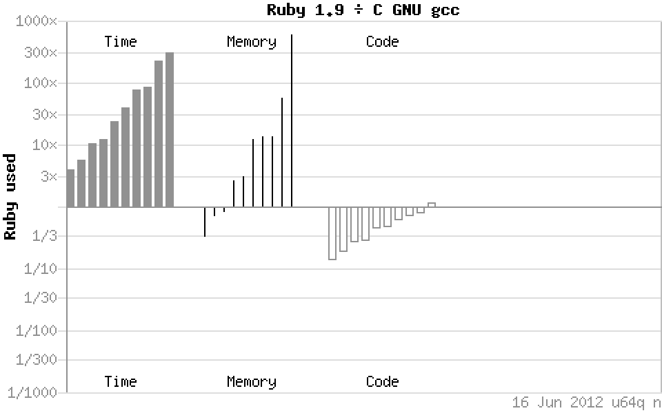

!SLIDE center transition=scrollLeft

[shootout.alioth.debian.org / u64q / benchmark.php ? test=all & lang=yarv & lang2=gcc](http://shootout.alioth.debian.org/u64q/benchmark.php?test=all&lang=yarv&lang2=gcc)

!SLIDE bullets incremental transition=scrollLeft
# wydajność
* zasada Pareto: 80% czasu w 20% kodu
* **po zoptymalizowaniu algorytmów** przepisać do C
* funkcje wbudowane kompilatora
